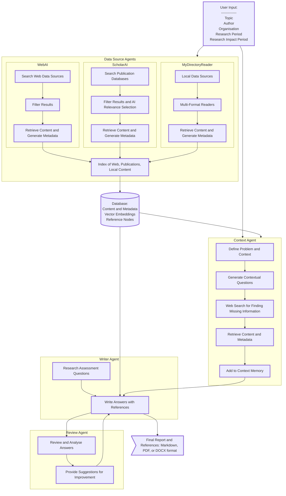

```mermaid

graph TD;
    A[User Input:
    -------------
    Topic
    Author
    Organisation
    Research Period
    Research Impact Period
    ]

    subgraph Data[Data Source Agents]
            subgraph WebAI
                B[Search Web Data Sources];
                D1[Filter Results];
                D2[Retrieve Content and Generate Metadata];
            end
        subgraph ScholarAI
            C[Search Publication Databases];
            E1[Filter Results and AI Relevance Selection];
            E2[Retrieve Content and Generate Metadata];
        end
        subgraph MyDirectoryReader
            X[Local Data Sources];
            Y[Multi-Format Readers]
            Z[Retrieve Content and Generate Metadata]
        end
        F[Index of Web, Publications, Local Content];
    end

    G[(Database:
    Content and Metadata
    Vector Embeddings
    Reference Nodes)]

    subgraph Context[Context Agent]
        H[Define Problem and Context];
        I[Generate Contextual Questions];
        J[Web Search for Finding Missing Information]
        K1[Retrieve Content and Metadata];
        K2[Add to Context Memory];
    end

    subgraph Four[Writer Agent]
        L[Research Assessment Questions];
        M[Write Answers with References];
    end

    subgraph Five[Review Agent]
        N[Review and Analyse Answers];
        O[Provide Suggestions for Improvement];
    end

    P>Final Report and References: Markdown, PDF, or DOCX format];

    A --> Data;
    B --> D1;
    C --> E1;
    D1 --> D2;
    D2 --> F;
    E1 --> E2;
    E2 --> F;
    F --> G;
    A --> Context;
    G -->Context;
    H --> I;
    I --> J; 
    J --> K1;
    K1 --> K2;
    L --> M;
    G --> M;
    K2 --> M;
    M --> N;
    N --> O;
    O --> M;
    M --> P;
    X --> Y;
    Y --> Z;
    Z --> F;

    classDef default stroke-width:3px;

```